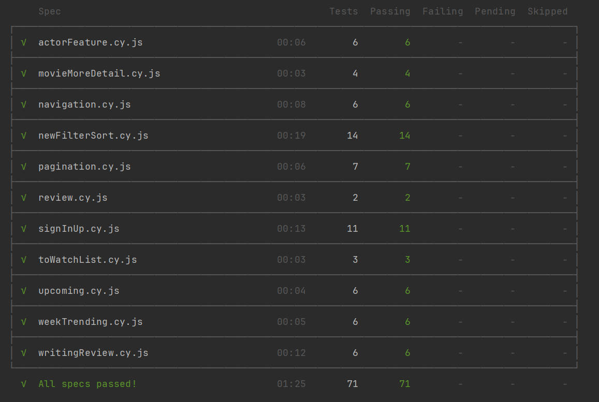
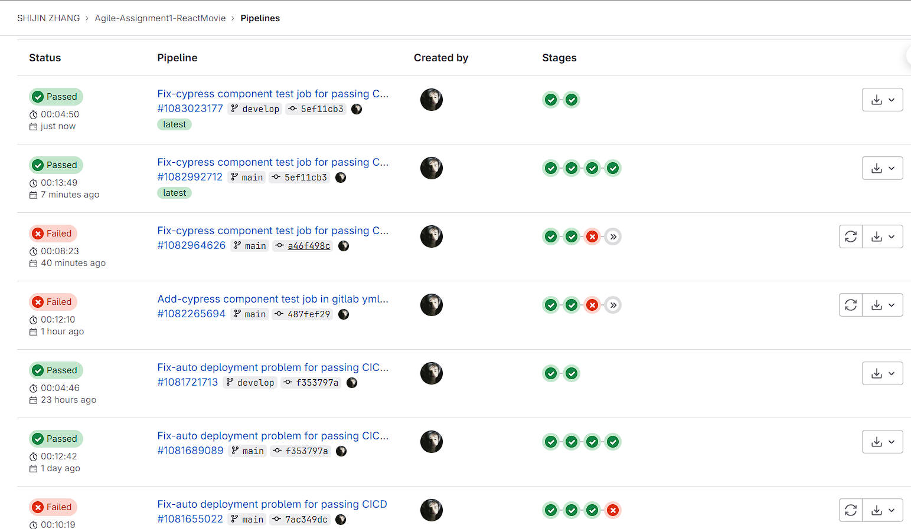
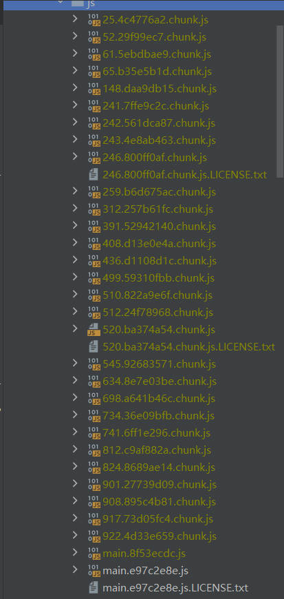
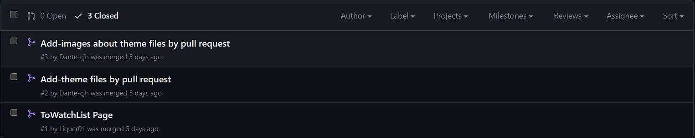
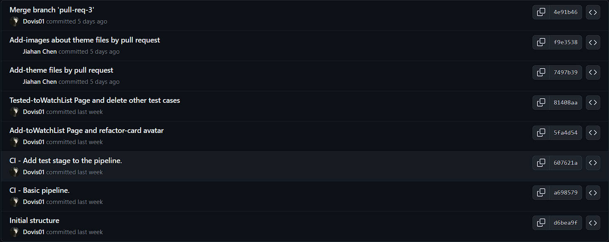
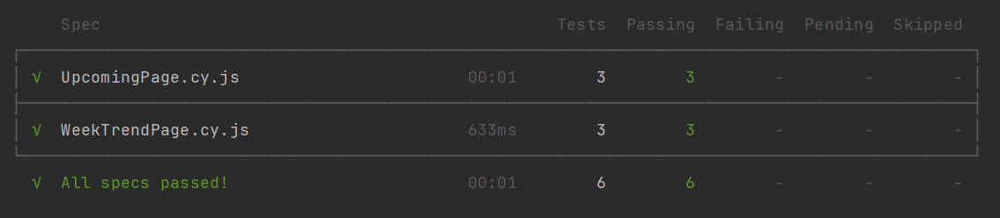
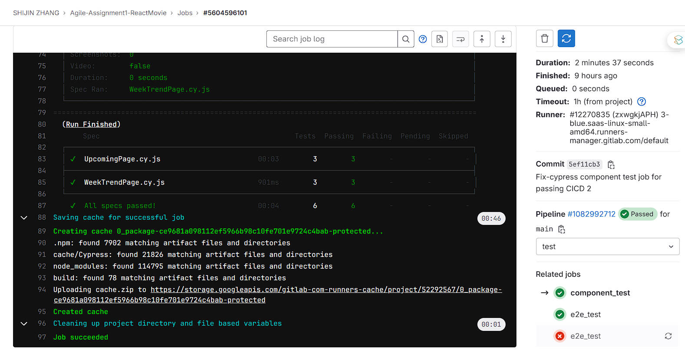
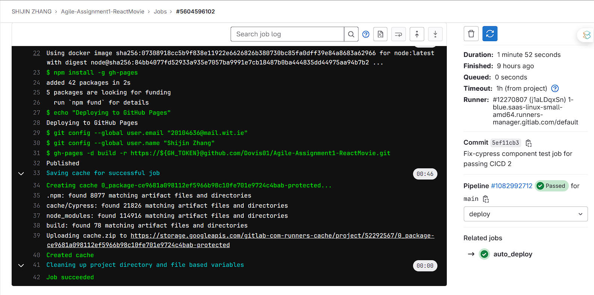
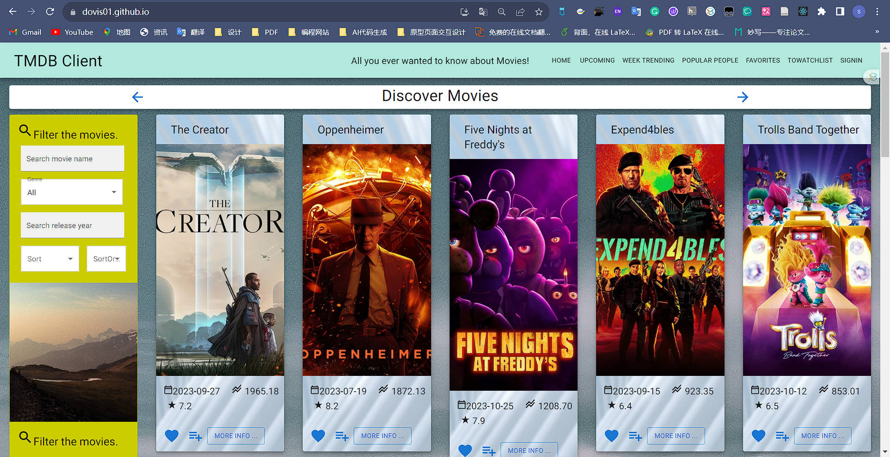

# Assignment 1 - Agile Software Practice.

__Name:__ Shijin Zhang

This repository contains the implementation of a React App, its associated Cypress tests and the GitLab CI pipeline.

`Website`: [https://dovis01.github.io](https://dovis01.github.io)

`GitLab`: [https://gitlab.com/Dovis01/agile-assignment1-reactmovie](https://gitlab.com/Dovis01/agile-assignment1-reactmovie)

`YouTube`:

- Use the early version of Movie App to do all tests :  [https://www.youtube.com/watch?v=vt9qCjLfeVI](https://www.youtube.com/watch?v=vt9qCjLfeVI)
- This is the final version of Movie App for Web App Dev:  [https://www.youtube.com/watch?v=1wJ7hZjHOYI](https://www.youtube.com/watch?v=1wJ7hZjHOYI)

## Setup Requirements

I used `npm` to manage packages in this project, and uploaded the `package.json` file. Enter `npm install` to install all the dependencies demanded.

After installing all packages, use `npm start` to run this project. Open [http://localhost:3000](http://localhost:3000/) to view it in your browser.

Scripts listed here:

- `npm install` - install npm dependencies
- `npm start` - start the react project
- `npm run build` - bundle up this application
- `npm run deploy` - deployment command
- `npm run analyze` - run source map explorer 
- `npx cypress run` - cypress E2E tests in headless mode
- `npx cypress run --component` - cypress components tests in headless mode
- `npx cypress open` - open cypress GUI

## React App Features.

+ Feature 1 - Improve filter options - Existing feature
  + **Enhanced Movie Discovery**: Users can now discover movies through various filters such as genre, release year, and sorting options by popularity or rating, making it easier to find movies that match their interests.

+ Feature 2 - Improve movie card - Existing feature
  + **Additional Movie Card Properties ** : Each movie card adds a property about popularity and a quick option to add the movie to the user's watchlist, including a corresponding watchlist avatar.

+ Feature 3 - Improve movie detail page - Existing feature
  + **Full Movie Details**: By clicking on "More Info," users can access comprehensive details about the movies, including full cast lists, preview videos of movie, and user reviews. Add the horizontal scroll bar to present the full casts and each movie actor cards  can link to the actor detail page which the url of can also change including the multiple parameters by clicking. 

+ Feature 4 - Improve favorites page - Existing feature
  + **Remove Favorites**: Add the functional button to remove the favorite movies from favorites page

+ Feature 5 - New page
  + **Upcoming Movies Preview**: A dedicated section for upcoming movies has been added, giving users a glimpse into future releases and anticipated titles.
  + **Weekly Trending Movies**: The app features a dynamic list of trending movies, updated weekly, to keep users informed about the most popular titles.
  + **Popular People**: A new page that showcases popular actors, allowing users to explore  their favorite actors.
  + **Popular People Detail Page**: By clicking on "More Info," users can access comprehensive  new details (gender, place of birth, birthday, popularity and known as) about the actor, including full related movie lists and TV lists. Add the horizontal scroll bar to present the full related movies and TV. And each related credit cards  can link to the movie detail page which the url of can also change including the multiple parameters by clicking. 
  + **To Watch List**: Users can  add movies to their watchlist for future reference and remove movies from their watchlist, enhancing the personalized experience of the app.
  + **Add Reviews Form Page**: Users can submit their own thoughts and reviews about the movies.

+ Feature 6 - New Sign In and Up option
  + **User Authentication**: The application now supports sign-in and sign-up functionality, including third-party authentication options like Google and GitHub, ensuring a secure and personalized user experience by using firebase. And sign-in and sign-up functionality is completed by Email and Password on two different pages.

+ Feature 7 - New Material UI component
  + **Pagination component**: Now users can look through all movies on all movie list page, and each page only present 20 movies. The actor list page( popular poeple page ) is the same.
  + **ThemeProvider component**: We use the component to customize the site header color.

+ Feature 8 - New background Image and color
  + **Background Image**: Add the background image for all pages and presentstion cards.
  + **Background Color**: Add the custom background color for all detail pages.


## Automated Tests.

### Unique functionality testing .

**Favorites Management**: Users can mark movies as their favorites, and those selected movies are presented on a separate Favorites page.

- cypress/e2e/favorites.cy.js

**Watchlist Integration**: Allows users to add movies to a personal watchlist, which can be reviewed or removed at any time.

- cypress/e2e/toWatchList.cy.js

**Movie Reviews Form**: Users can submit reviews for movies, providing ratings and feedback.

- cypress/e2e/writingReview.cy.js

**Filter and Sort**: Dynamic filtering and sorting capabilities (Asc / Desc) enable users to find movies based on different criteria such as genre, popularity, rating or release year.

- cypress/e2e/newFilterSort.cy.js

**Movie Details Expansion**: Test the feature that it allows users to view extended details of a movie, such as full cast and crew and preview video of movie, and jumps to the corresponding actor detail page, by expanding the movie detail section.

- cypress/e2e/movieMoreDetail.cy.js

**Actor Details**: Provides in-depth information about actors, including their filmography and personal information details. And test whether the content  is correct and it can jump to the movie detail page.

- cypress/e2e/actorFeature.cy.js

**Upcoming Movies Showcase**: A section dedicated to showcasing movies that are scheduled to be released in the future. Test all  running process, presentation information and jumping function.

- cypress/e2e/upcoming.cy.js

**Trending Movies**: A weekly updated list showing trending movies based on popularity.Test all  running process, presentation information and jumping function.

- cypress/e2e/weekTrending.cy.js

**User Authentication**: Tests the sign-in and sign-up processes by email and password. It can return correct prompt information and go back the correct page.

- cypress/e2e/signInUp.cy.js

**Pagination Control**: Ensures that users can navigate through lists of movies using pagination and some error test.

- cypress/e2e/pagination.cy.js

**Navigation Workflow**: Confirms the app's navigation links and routes are functioning as intended both mobile and desktop way.

- cypress/e2e/navigation.cy.js



### Error/Exception testing.

**cypress/e2e/newFilterSort.cy.js**

1. Display matches for new release year filtering due to inputting invalid years.
2. Display matches for new release year filtering due to inputting future years.
3. Sort when the sort option dropdown is set to "None".
4. Sort when the sort order dropdown is set to "None".
5. When the selected release year are no matches, sort the movies.

**cypress/e2e/pagination.cy.js**

1. Click the next page button on the last page.
2. Navigate to the previous page on the first page.

**cypress/e2e/signInUp.cy.js**

1. Sign up by registered email address.
2. Submitting a sign-up form when the username and password is blank.
3. Sign in by unregistered email address.
4. Sign in by wrong password.
5. Submitting a sign-in form when the username and password is blank.
6. Sign in by invalid email address.

**cypress/e2e/writeReview.cy.js**

1. Submit a movie review form when the author field is blank.
2. Submit a movie review form when the review text is blank.
3. Submit a movie review form when both the review text and author field are blank.
4. Submit a movie review form when the review text is too short.


### Cypress Custom commands.

**cypress/e2e/actorFeature.cy.js**

+ cy.testActorListPage() 

**cypress/e2e/navigation.cy.js**

+ cy.testNavigationToDetailPage() 

**cypress/e2e/newFilterSort.cy.js**

+ cy.assertCheckCardNumberLength() 
+ cy.testAllCardHeaderContent()

**cypress/e2e/pagination.cy.js**

+ cy.testListPageByPage()

**cypress/e2e/upcoming.cy.js**

+ cy.testListPage()
+ cy.testNavigationToDetailPage()

**cypress/e2e/weekTrending.cy.js**

+ cy.testListPage()
+ cy.testNavigationToDetailPage()

Check all custom commands in file [`cypress/support/commands.js`](https://github.com/Dovis01/Agile-Assignment1-ReactMovie/blob/main/cypress/support/commands.js)

## Continuous Integration

Check continuous integration configuration file: [.gitlab-ci.yml](https://github.com/Dovis01/Agile-Assignment1-ReactMovie/blob/main/.gitlab-ci.yml).

### Pipeline

Four stages in pipeline: install, build, test, deploy.



### Branching policy

- Develop Branch - execute Install and build jobs only.
- Main Branch - perform Install, build, test and deploy jobs.

## Code Splitting.

+ src/index.js
+ src/pages/addMovieReviewPage.js
+ src/pages/movieDetailsPage.js
+ src/pages/movieReviewPage.js
+ src/pages/peopleDetailsPage.js
+ src/pages/signUpPage.js
+ src/components/movieDetails/index.js



## Pull Requests.

+ https://github.com/Dovis01/Agile-Assignment1-ReactMovie





## Independent learning.

### Automated Component Tests

- Simulate API request data and provide sample api data to running component test
- Display basic elements and content in components
- Test whether the wanted buttons appear when the components are rendered
- Add environment configuration in [`cypress.config.js`](https://github.com/Dovis01/Agile-Assignment1-ReactMovie/blob/main/cypress.config.js)
- Add configuration of automated components test in [`.gitlab-ci.yml`](https://github.com/Dovis01/Agile-Assignment1-ReactMovie/blob/main/.gitlab-ci.yml)
- `cypress/component/UpcomingPage.cy.js`
- `cypress/component/WeekTrendPage.cy.js`

```javascript
const { defineConfig } = require("cypress");

module.exports = defineConfig({
  e2e: {
    baseUrl: "http://localhost:3000/",
    specPattern: 'cypress/e2e/**/*.cy.{js,jsx}',
    viewportWidth: 1980,
    viewportHeight: 1080,
    setupNodeEvents(on, config) {
      // implement node event listeners here
    },
  },

  component: {
    specPattern: 'cypress/component/**/*.cy.{js,jsx}',
    devServer: {
      framework: "create-react-app",
      bundler: "webpack",
    },
  },
});
```

```yaml
e2e_test:
  stage: test
  image: cypress/browsers:node16.13.0-chrome95-ff94
  only:
    - main
  script:
    - echo "Run e2e tests in headless mode"
    - npx serve -s ./build  -l 3000  &
    - npx cypress run --e2e --browser chrome

component_test:
  stage: test
  image: cypress/browsers:node16.13.0-chrome95-ff94
  only:
    - main
  script:
    - echo "Run cypress component tests in headless mode"
    - npx cypress run --component
```

```jsx
cy.mount(
            <QueryClientProvider client={queryClient}>
                <Router>
                    <MoviesContextProvider>
                        <UpcomingMoviesPage/>
                    </MoviesContextProvider>
                </Router>
                <ReactQueryDevtools initialIsOpen={false}/>
            </QueryClientProvider>
        );
cy.mount(
            <QueryClientProvider client={queryClient}>
                <Router>
                    <MoviesContextProvider>
                        <WeekTrendingMoviesPage/>
                    </MoviesContextProvider>
                </Router>
                <ReactQueryDevtools initialIsOpen={false}/>
            </QueryClientProvider>
        );
```





### Auto Deployment

Use `GitHub Pages` to implement the simple auto deployment, and it will delivery every time if there is an update in `main` branch in gitlab.

Add configuration of auto deployment in [`.gitlab-ci.yml`](https://github.com/Dovis01/Agile-Assignment1-ReactMovie/blob/main/.gitlab-ci.yml) and [`package.json`](https://github.com/Dovis01/Agile-Assignment1-ReactMovie/blob/main/package.json)

This is the auto deployment pipeline stage code in `.gitlab.ci.yml`:

```yaml
auto_deploy:
  stage: deploy
  only:
    - main
  script:
    - npm install -g gh-pages
    - echo "Deploying to GitHub Pages"
    - git config --global user.email "20104636@mail.wit.ie"
    - git config --global user.name "Shijin Zhang"
    - gh-pages -d build -r https://${GH_TOKEN}@github.com/Dovis01/Agile-Assignment1-ReactMovie.git
  environment:
    name: production
    url: https://dovis01.github.io/Agile-Assignment1-ReactMovie
```

This is the screenshot for CICD pipeline auto_deploy job passing:



This is the changed part of `package.json`:

```json
"scripts": {
    "predeploy": "npm run build",
    "deploy": "gh-pages -d build",
    ...other part...
  },
...other part...
"homepage": "https://dovis01.github.io"
```

Visit the project:  [https://dovis01.github.io](https://dovis01.github.io)



